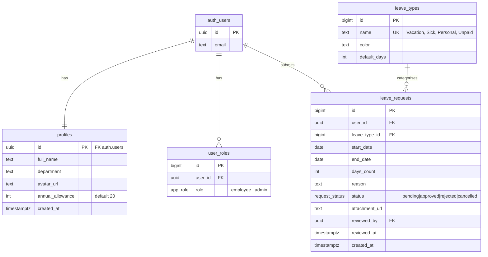

# LeaveHub 🗓️

A **paid time-off (PTO) tracker**. Employees request days off, track their
remaining allowance and attach supporting documents; admins review and approve
or reject requests and manage the team.

Built for the SoftUni **Software Technologies with AI** capstone project using
AI-assisted development.

- **Live app:** _(deployed on Vercel — see Deployment)_
- **Repository:** https://github.com/neofitov/leavehub

## Demo credentials

| Role | Email | Password |
|------|-------|----------|
| Admin | `admin@demo.com` | `demo123` |
| Employee | `demo@demo.com` | `demo123` |

Two more employees (`maria@demo.com`, `peter@demo.com`) exist with the same
password, so the admin panel has real data to review.

---

## What it does

**Employees**
- Register / log in / log out
- See a dashboard with their remaining allowance, days used, and pending days
- Submit a leave request (type, date range, reason, optional attachment)
- Browse their requests, filter by status, and cancel one while it's pending
- Edit their profile and upload an avatar

**Admins**
- Everything above, plus an **Admin Panel**:
  - Review every request and approve or reject it
  - Manage users: grant/revoke the admin role, set annual allowance
  - Manage leave types (add / delete)

Leave balance is `annual_allowance − approved paid days this year`. Unpaid leave
doesn't consume the paid allowance.

---

## Architecture

```
┌─────────────────────────────┐         ┌──────────────────────────┐
│  Browser (static SPA)       │  HTTPS  │  Supabase                │
│                             │ ──────► │                          │
│  HTML + CSS + vanilla JS    │  REST   │  Postgres (RLS)          │
│  Bootstrap 5 + Icons        │  +JWT   │  Auth (JWT)              │
│  History-API router         │         │  Storage (2 buckets)     │
│  Built & bundled by Vite    │ ◄────── │                          │
└─────────────────────────────┘         └──────────────────────────┘
        deployed on Vercel
```

**Client–server model.** The frontend is a static bundle; there is no custom
backend server. It talks directly to Supabase's REST API using the *publishable*
key, authenticating each request with the signed-in user's JWT.

**Security lives in the database, not the UI.** Every table has Row-Level
Security enabled. Hiding a button never grants or denies access — the policies
do. See [Security](#security).

### Tech stack

| Layer | Tech |
|-------|------|
| Frontend | HTML, CSS, vanilla JavaScript (ES modules), Bootstrap 5, Bootstrap Icons |
| Build | Node.js, npm, Vite |
| Backend | Supabase — Postgres, Auth, Storage |
| Hosting | Vercel (static build + SPA rewrites) |

No TypeScript, no React/Vue — per the project requirements.

### Routing

A small History-API router (`src/router.js`) maps clean URLs to lazy-loaded page
modules and enforces guards (`auth`, `admin`, `guestOnly`).

| URL | Page | Access |
|-----|------|--------|
| `/` | Landing | public |
| `/login` | Register + login | guests only |
| `/dashboard` | Balance + recent requests | authenticated |
| `/requests` | My requests (status filter) | authenticated |
| `/requests/new` | New request + attachment upload | authenticated |
| `/requests/:id` | Request detail, download, cancel | authenticated |
| `/profile` | Edit profile + avatar upload | authenticated |
| `/admin` | Admin panel | admin only |

`vercel.json` rewrites all paths to `index.html` so deep links work.

---

## Database schema

Four tables, all with RLS enabled.



**Notes**
- `profiles` extends `auth.users` 1:1. A trigger (`handle_new_user`) creates the
  profile and a default `employee` role on sign-up.
- Roles live in `user_roles` (RBAC), not on the user row, so a user can hold
  more than one role.
- Indexes on `leave_requests(user_id)`, `(status)`, `(leave_type_id)` and
  `user_roles(user_id)`.
- Constraints: `end_date >= start_date`, `days_count > 0`, `annual_allowance >= 0`.

### Migrations

All schema changes are SQL migrations in [`supabase/migrations/`](supabase/migrations/),
applied to Supabase and committed here:

| Migration | Purpose |
|-----------|---------|
| `…_init_schema.sql` | Enums, 4 tables, indexes, `is_admin()`, new-user trigger |
| `…_rls_policies.sql` | RLS enabled + policies on every table |
| `…_storage.sql` | `avatars` + `attachments` buckets and their policies |
| `…_security_hardening.sql` | Fixes raised by Supabase's security advisor |
| `…_fix_avatar_upsert.sql` | Owner-scoped `SELECT` on `avatars`, required by `upsert` |

---

## Security

Access control is enforced by Postgres RLS. Highlights:

- **Employees** can read/insert only their own `leave_requests`. Their `UPDATE`
  policy requires the row to still be `pending` and restricts the new status to
  `pending` or `cancelled` — so **self-approval is impossible**.
- **Admins** (checked via a `SECURITY DEFINER` `is_admin()` helper, which avoids
  recursive policy evaluation on `user_roles`) can read all rows and set status.
- Only admins may modify `user_roles` or `leave_types`.
- Storage files are namespaced `"<user_id>/<file>"`; policies scope writes to the
  owner's folder. `attachments` is a private bucket read via short-lived signed
  URLs; `avatars` is public-read (served by public URL, listing disabled).
- All user-supplied text is escaped before being inserted into the DOM.

These claims are **tested**, not assumed:

```bash
npm run verify:rls
```

Signs in as a real admin and a real employee and asserts the database rejects
privilege escalation (14 checks). It reverts anything it changes.

---

## Local development

**Prerequisites:** Node.js 18+ and a Supabase project.

```bash
git clone https://github.com/neofitov/leavehub.git
cd leavehub
npm install

cp .env.example .env      # then fill in your Supabase values
npm run dev               # http://localhost:5173
```

`.env` (never committed):

```ini
VITE_SUPABASE_URL=https://<project-ref>.supabase.co
VITE_SUPABASE_PUBLISHABLE_KEY=sb_publishable_...
SUPABASE_SECRET_KEY=sb_secret_...   # seed script only; bypasses RLS
```

> Supabase's newer key format is used: **publishable** (safe in the browser)
> replaces `anon`, and **secret** (server-side only) replaces `service_role`.

**Set up the database**

1. Apply the SQL files in `supabase/migrations/` in filename order (Supabase SQL
   Editor, or `supabase db push` with the CLI).
2. In **Authentication → Providers → Email**, turn **off** "Confirm email" so
   registration logs users in immediately.
3. Seed demo users and sample data:

```bash
npm run seed
```

**Scripts**

| Command | Does |
|---------|------|
| `npm run dev` | Vite dev server |
| `npm run build` | Production build to `dist/` |
| `npm run preview` | Serve the production build |
| `npm run seed` | Create demo users, leave types, sample requests |
| `npm run verify:rls` | Assert RLS blocks privilege escalation |

---

## Project structure

```
timeoff-tracker/
├─ index.html                      # single HTML entry; #app is the mount point
├─ vite.config.js                  # Vite config
├─ vercel.json                     # SPA rewrites so deep links resolve
├─ .env.example                    # template for local secrets
├─ .github/copilot-instructions.md # instructions for the AI dev agent
├─ supabase/migrations/            # SQL schema history (source of truth)
├─ scripts/
│  ├─ seed.js                      # demo users + sample data (secret key)
│  └─ verify-rls.mjs               # security checks against the live DB
└─ src/
   ├─ main.js                      # entry: mounts shell, restores session, starts router
   ├─ router.js                    # History-API router + route guards
   ├─ supabase/client.js           # the single Supabase client instance
   ├─ components/                  # header, footer, toast, confirmDialog
   ├─ pages/                       # one module per screen (lazy-loaded)
   ├─ services/                    # all Supabase access — pages never call it directly
   ├─ utils/                       # dom, dates, status helpers
   └─ styles/main.css              # custom CSS on top of Bootstrap
```

**Key idea:** pages render and handle interaction; **services** own every
Supabase call. That keeps data access in one place and pages thin.

---

## Deployment

The app is a static bundle deployed on **Vercel**:

1. Import the GitHub repo into Vercel.
2. Framework preset **Vite** (build `npm run build`, output `dist`).
3. Add environment variables `VITE_SUPABASE_URL` and
   `VITE_SUPABASE_PUBLISHABLE_KEY`.
4. Deploy. `vercel.json` rewrites every route to `index.html`, so `/requests/12`
   loads correctly on a hard refresh.

Every push to `main` triggers a redeploy.
